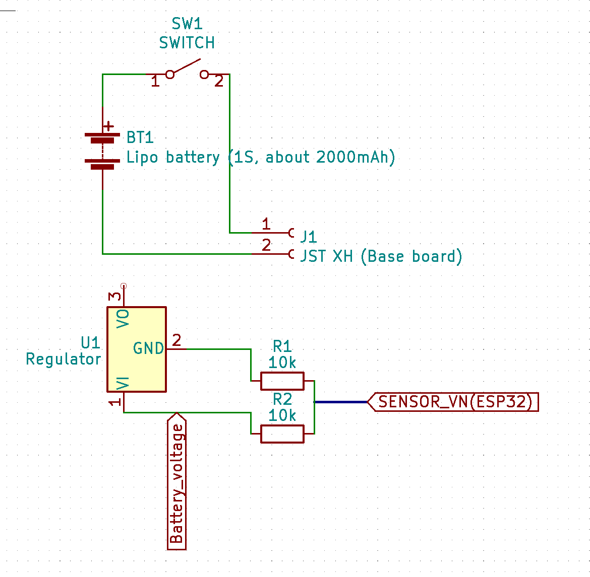
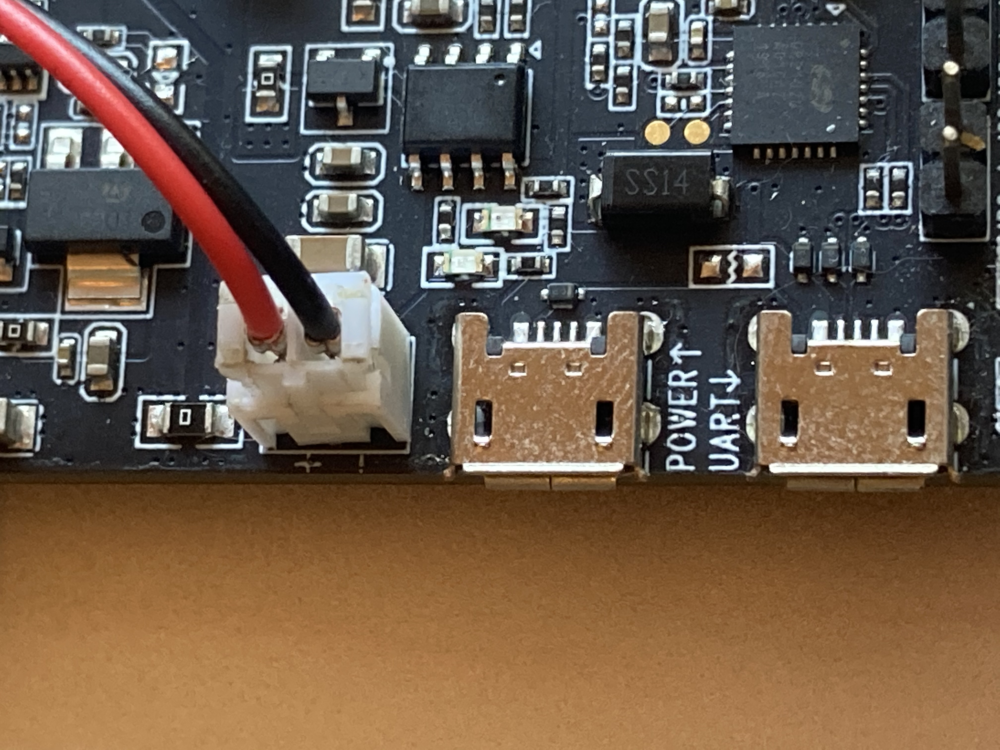
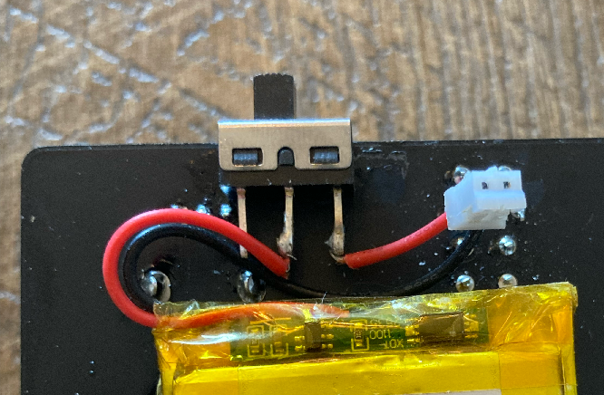
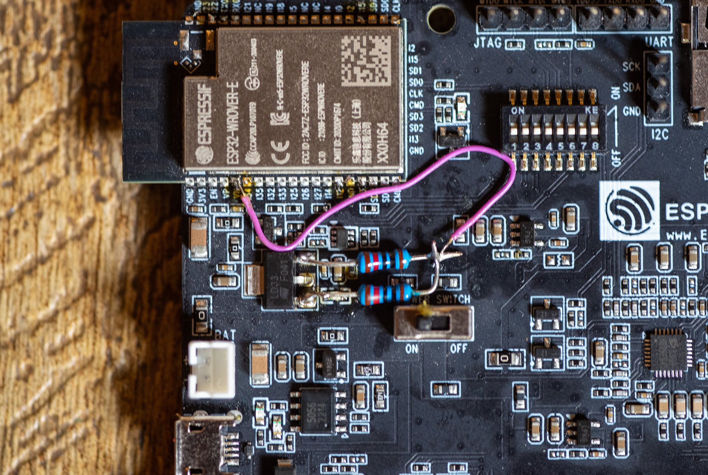

# Battery operation (Updated Sep, 2023)

## WARNING: 

This is for advanced users who is familiar with soldering. No warranty when the unit is broken by the modification. (I can answer questions on Discord, and I can sell only the bottom board in case you broke it)

## Summary:

The base board (ESP32 Lyrat) has **a Lipo charger circuit** and the JST PH connector for Lipo battery, but it's unused. It means you can connect Lipo to the base board for the battery operations. 

Problem is there is no good point to capture battery voltage so you need to make the point. Schematic shows how to make it. Connect the middle point to SENSOR_VN port of ESP32.

## Parts list:

 - Lipo battery : Select Lipo battery with safety circuit to avoid over discharge(When you see any circuit in the Lipo that's it). I use 2000mah https://a.co/d/3RQlaXL or https://a.co/d/gD3ePgJ, 1500mAh might be more options. If thickness is about 6mm then you might be able to fit it. Screw or spacer might need adjustment.
 - SPST Switch: A generic SPST Switch. (https://a.co/d/3IWfl5n)
 - 10K resistor x 2 (Accuracy of 1%)
 - Some wire

## Schematic

## Steps to install

1. Remove bottom board.

2. Trim spiky button legs to protect Lipo.  Optionally you want to cut the switch on the board to make a room for Lipo(You don't need the main switch of the base board, it's always ON).

3. Check the polarity of Lipo battery.  ***There is no standard Polarity for Lipo battery!!!***  . Check the polarity signs (+ and -) on the base board. If you purchase the lipo that has wrong polarity, just remove the plastic piece on the board and flip it. The part is flippable.

   

4. Solder battery and switch

   

5. Glue switch to the board, and install the battery between the base board and the main circuit board. Don't short the circuit.

6. Solder 10k resistor x 2 and connect the middle point to **SENSOR_VN** port of ESP32, as the schematic shows.

7. Assemble the unit and test.

## Operations

- When the switch is OFF, you can use USB as a power source.
- When the switch is ON, Battery will be used as a power source AND USB will charge the battery. However, the unit might be not stable when the battery is very low capacity. Switch off when it is not stable.
- To charge, turn the switch to ON and connect USB cable. Extra red LED on the base board will be lit. It changes green when the charge is finished.
- Always turn off the switch when you connect or disconnect USB cable.
- When you solder resistors and connect the middle point to SENSOR_VN port, you can monitor battery status with **the 4.58 firmware (or later)**. The dots indicated at the top right shows battery status (4 dots means full, in the screenshot it shows 2 dots). Charge device when you see the dot is only one. "LOW BATTERY" message will be shown when battery goes low.

- When the battery goes close to empty, the synth will try to sleep. it might hang, or issue with SD card access. Charge the battery to recover.